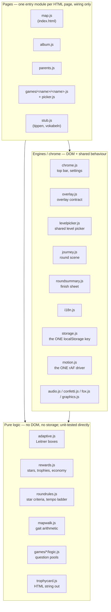
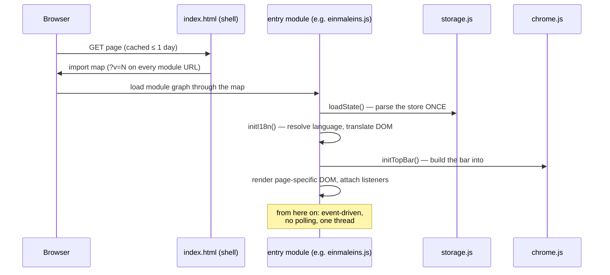
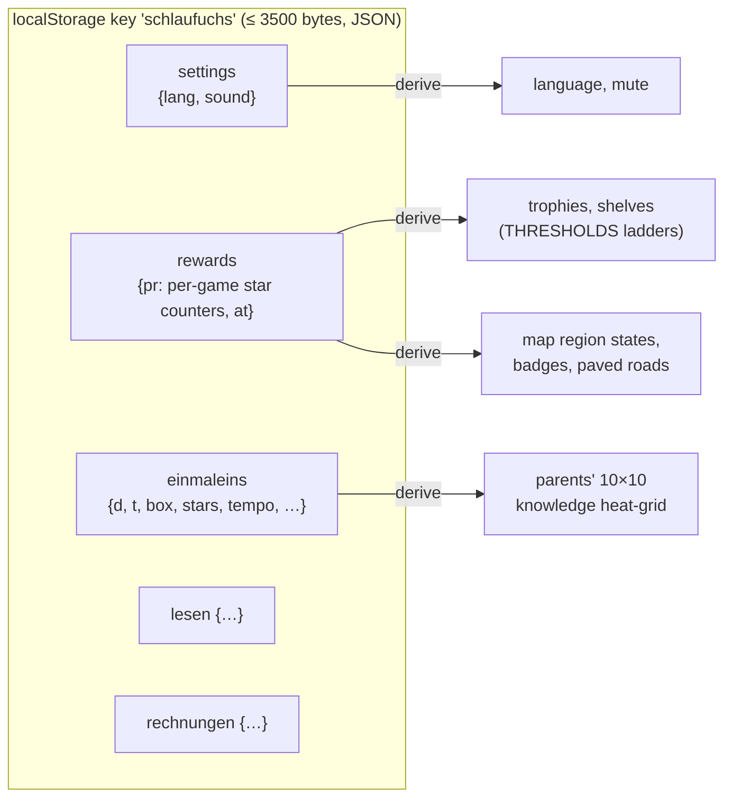
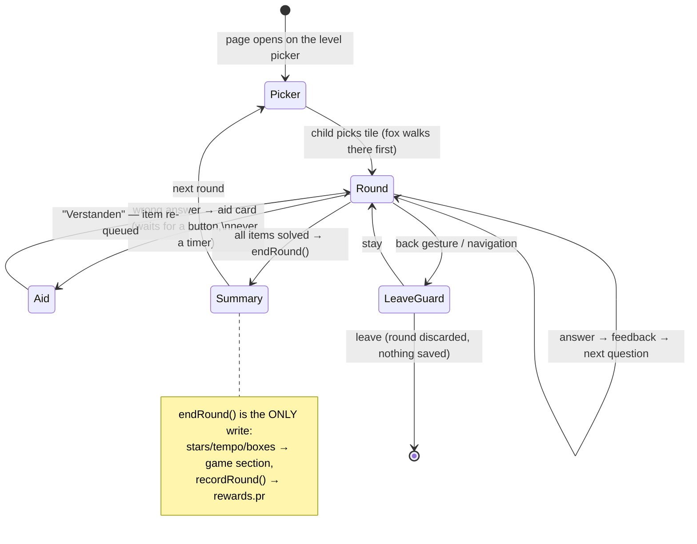
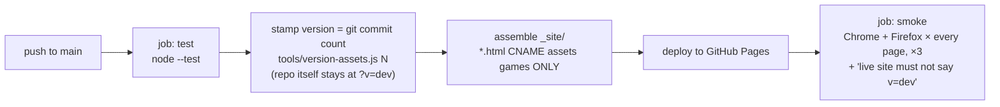

# Codebase Tour — Schlaufuchs, explained for a systems programmer

A thorough walk through this repository for someone fluent in C++ but new to
web front-ends. It explains the layout, the architecture and *why* it is
shaped that way, how the web platform pieces map onto concepts you already
know, how the tests work, and what is still open.

Companion documents (this one does not replace them):

- `docs/SPEC.md` — the authoritative **product** spec. Code comments cite it
  (`§10.3`). If behaviour and SPEC disagree, the SPEC wins.
- `docs/ARCHITECTURE.md` — the terse map of the code for someone who already
  knows the web platform. This tour is the long-form version of it.
- `CLAUDE.md` — working rules and tooling, learned incident by incident.
- `docs/NEW_GAME.md` — the checklist for shipping a new game.

---

## 1. What this is, in one paragraph

A static website of educational browser games for children (5–15), framed as
an illustrated island map, live at <https://schlaufuchs.ankerl.com>. It is
**fully client-side**: plain HTML/CSS/JavaScript, no server code, no build
step, no third-party dependency, no framework. All persistent state lives in
a single localStorage entry on the child’s device; nothing ever leaves it (no analytics,
no network traffic after page load). Hosting is GitHub Pages, which serves
files exactly as committed.

## 2. Web platform primer — the C++ mapping

The concepts you need, phrased in terms you already use daily.

| Web thing | Closest C++ analogue | Notes for this repo |
|---|---|---|
| **ES module** (`import`/`export`) | A translation unit with an explicit export list | One `.js` file = one module. No headers; the `export` keyword *is* the public interface. Circular imports resolve (like forward declarations) but are avoided here. |
| **No build step** | Shipping source instead of binaries | The file you edit is byte-for-byte the file the browser executes. There is no compiler to catch a typo — the "linker error" happens at runtime, in a child's browser. This is *the* reason for the test discipline (§7). |
| **Module-level `let`/`const`** | `static` storage duration in a TU | A module is instantiated **once per unique URL** and cached. `overlay.js` keeps its set of open overlays in module scope — a genuine singleton, but only as long as every importer resolves the module to the *same* URL (see import maps, below). Think ODR: two URLs for one module = two copies of its statics. |
| **Import map** | A linker script / symbol interposition table | A JSON blob in each HTML page that rewrites import specifiers before resolution. This repo uses it purely for cache-busting: it maps `.../storage.js` → `.../storage.js?v=N`. |
| **The DOM** | A retained-mode UI tree, like a scene graph | `document.getElementById("x")`, `el.textContent = "…"`, `el.addEventListener("click", fn)`. JS mutates the tree; the browser renders it. No message loop you own — everything is callbacks on the browser's single thread. |
| **Single-threaded event loop** | One thread, a task queue, no preemption | No data races, ever. But a long-running function freezes the UI, and "later" is expressed via callbacks (`setTimeout`, `requestAnimationFrame`) instead of threads. |
| **`requestAnimationFrame` (rAF)** | A per-frame tick callback (like a game loop's frame hook) | The browser calls you back before the next repaint (~60 Hz). All scripted animation here runs through *one* rAF driver, `runWalk` in `motion.js`. |
| **localStorage** | A tiny persistent key-value blob (think EEPROM with a budget) | Per-origin, ~5 MB, never transmitted. This repo uses exactly **one** key, self-capped at 3500 bytes of JSON. The state lived in a cookie until July 2026 (a legacy cookie is adopted once, then deleted); the budget the cookie forced was kept as a commitment and shapes the whole state design (§5). |
| **CSS** | A declarative styling/layout language, cascade = specificity-ordered rule resolution | One stylesheet, `assets/css/schlaufuchs.css`. Layout is flexbox/grid, roughly "constraint-based box packing". |
| **`100dvh`, `clamp()`, media queries** | Runtime-evaluated layout constraints | `100dvh` = dynamic viewport height (mobile URL bars shrink it). The site's rule: every page fits `100dvh` with **no scrolling**. |
| **HTTP caching** | A distributed, per-file, TTL-based artifact cache with no coherence protocol | GitHub Pages serves `Cache-Control: max-age=86400` — each file expires on its *own* clock. Mixing a cached old HTML with a fresh JS module is the web's ABI-mismatch bug. The versioning scheme in §8 exists solely for this. |
| **`node --test`** | `ctest` | Node.js (server-side JS runtime) runs the unit tests. There is no DOM in Node — which is exactly why testable logic must be DOM-free. |

Two runtime differences worth internalizing early:

1. **JavaScript fails silently by default.** Calling a method on `undefined`
   throws, but many wrong programs don't: `dict[missingKey]` yields
   `undefined`, `t(undefined)` renders an empty string, a lookup of a
   non-existent element id gives `null` and an `if (el)` guard turns the bug
   into a no-op. There is no type system and no linker here. The repo's
   counter-doctrine: *"Silent no-ops are the dangerous ones — prefer a test
   that asserts the wiring exists."*
2. **You cannot trust your own eyes less than you think.** `node --test`
   passing says nothing about layout. Every visual bug this project has had
   was invisible in the diff and obvious in a screenshot. Hence the
   screenshot tooling (§7.4).

## 3. Repository layout

```
schlaufuchs/
├── index.html                 # the world map (entry page; inline SVG island)
├── album.html                 # trophy room
├── parents.html               # parents' view (knowledge heat-grid, per-game reset)
├── about.html, privacy.html   # reader pages
├── CNAME                      # custom-domain marker for GitHub Pages
├── assets/
│   ├── css/schlaufuchs.css    # the ONE stylesheet
│   ├── fonts/                 # self-hosted woff2 (no CDN — nothing external, ever)
│   ├── i18n/de.js, en.js      # the two string dictionaries (key parity enforced)
│   ├── img/icons/             # real SVG icons (mostly not yet used — see §10)
│   └── js/                    # all shared modules (the "library")
├── games/
│   ├── einmaleins/            # times tables — the worked example of a game
│   │   ├── index.html         #   page shell + import map
│   │   ├── einmaleins.js      #   wiring (DOM, events)
│   │   ├── logic.js           #   pure logic (unit-tested)
│   │   ├── picker.js          #   adapter for the shared level picker
│   │   └── i18n.js            #   this game's strings, both languages
│   ├── lesen/                 # reading game (+ content.js, append-only)
│   ├── rechnungen/            # workbook arithmetic
│   ├── tippen/                # STUB — page only, no game
│   └── vokabeln/              # STUB — page only, no game
├── tests/                     # node --test suite (~38 files; see §7)
├── tools/                     # dev tooling: server, screenshots, drivers, PR loop
├── docs/                      # specs, plans, handoffs — NOT deployed
├── .githooks/                 # pre-commit (tests), pre-push (deletion guard)
└── .github/workflows/deploy.yml   # test → version-stamp → publish → smoke
```

Deploy copies **only** `*.html CNAME assets games`. Anything the site needs at
runtime must live under `assets/` or `games/`; `docs/` and `tools/` stay home.

## 4. Architecture — the three layers

The single most important design line in the codebase:

> **Arithmetic is pure and unit-tested; DOM code is thin and
> screenshot-tested.**

"Pure" means: no DOM, no storage, no i18n lookups — a function of its
arguments, like a `constexpr`-friendly free function. Everything that can be
wrong in an interesting way is pushed into this layer, because this layer is
the only one `node --test` can reach (Node has no DOM).



Dependency rules (enforced **by review and habit, not tooling** — an honest
open weakness, see §11):

- Pages import engines and pure logic. **Nothing imports a page.**
- Engines import engines and pure logic, never a page.
- Games never import each other. The one sanctioned border crossing: a page
  may import another game's `logic.js` when the logic *is* the point —
  `parents.js` reads the times tables through `games/einmaleins/logic.js`
  instead of growing a second copy of `pairOf`.
- No module emits an absolute `/assets/...` URL. Asset URLs resolve via
  `import.meta.url` (≈ "path relative to this TU"), so the site works when
  deployed under a subpath.

### 4.1 Anatomy of a page

Every HTML page is a thin shell with exactly three obligations:

1. the **versioned import map** (see §8),
2. an **empty** `<header class="topbar" id="topbar">`,
3. one `<script type="module">` loading its entry module.

The entry module calls `initI18n()` and `initTopBar()` and builds the rest.
The top bar is *always* rendered by `chrome.js` — never hand-written into a
page (a test fails if it is). This is how the site guarantees the bar is
pixel-identical everywhere: there is exactly one function that can produce it.

The two unbuilt games don't even get their own module: their pages carry
`<body data-game="tippen">` and share `stub.js`, which throws loudly on an
unknown name (deliberately — a silent fallback here would hide a typo forever).



## 5. State — one localStorage key, everything derived

This is the part of the design most worth studying, because every other
decision leans on it.

**All persistent state is one cookie named `schlaufuchs`**, holding
URL-encoded JSON, hard-capped at **3500 bytes** — `storage.js` *refuses*
writes over budget (returns `false`, logs a warning). Sections: `settings`,
`rewards`, and one per game.



Design consequences, in causal order:

- **Everything shown is derived on every load.** Trophies are not stored;
  they are computed from the per-game lifetime star counters (`rewards.pr`)
  run through per-game threshold ladders. Region states, badges, the parents'
  grid — all derived. Think of the store as the *minimal* serialized state
  and every screen as a projection of it. No derived value can ever go stale
  or disagree with its source, because it has no storage of its own.
- **Digit strings instead of arrays.** Per-item state (Leitner box per
  times-table fact, stars per level tile) is stored as a string of digits,
  one character per item in canonical order: `"2231402…"`. JSON arrays would
  cost `[2,2,3,…]` — brackets and commas triple the bytes. This is why
  `games/lesen/content.js` and the skill buckets in
  `games/rechnungen/logic.js` are **append-only**: an item's identity *is*
  its index into those strings. Reordering content would silently reassign
  every child's progress. (You know this failure mode: it is serialized
  enum-by-ordinal.)
- **Exactly one writer per section.** During play, *nothing* is written until
  the round ends: `endRound()` is the only writer of a game's section,
  `recordRound()` (in `rewards.js`) the only writer of `rewards`. A round in
  progress lives purely in memory — which is why `leaveguard.js` exists (a
  confirmation overlay when navigation would destroy an unsaved round, wired
  against the browser's *real* back gesture, not just in-page links).
- **Parsing is cached.** The hot paths (a sound effect per keypad press)
  land in `loadState()`; the raw stored string is the cache key, so any write
  — including another tab's — invalidates naturally. Callers treat the
  returned object as read-only; writes go through `save()`. Single-threaded,
  so this needs no locking.
- **Backup = the state as a file.** `exportState`/`parseBackup`/
  `replaceState` in `storage.js`: a parent can download the state as
  pretty-printed JSON and restore it whole on a new device. Restore is
  total-or-nothing — junk, arrays, or over-budget files are rejected before
  anything is touched.

Why a cookie at all, and not `localStorage` (a bigger key-value store)? The
practical ceiling is the same design pressure either way; the cookie's hard
4 KB browser limit made the budget non-negotiable from day one, and the
discipline it forces (digit strings, derive-don't-store) is treated as a
feature. The 3500-byte self-cap leaves headroom under the browser's limit.

## 6. The domain: rounds, stars, trophies

The vocabulary you'll meet in every module:

- A **round** is ~10 questions on one *tile* (a times table, a word pack, an
  arithmetic mode) at one *difficulty* (Leicht/Mittel/Schwer).
- **Stars (⭐)** are the site's only currency. A round pays 0–3 stars by
  *accuracy only* — ≥60 % / ≥80 % / 100 % first-try correct, computed as a
  ratio (`starNeeds()` in `roundrules.js`), never by speed. Speed has its own
  *additive* ladder (tempo tiers 🐢🚶🐇🚗🚀), which can only ever add — a
  deliberate decision after playtesting showed time pressure punishing a
  slow-but-correct child.
- Stars are **weighted** into a per-game lifetime counter `rewards.pr`
  (Leicht ×1, Mittel ×2, Schwer ×3). Internally the code calls this `points`;
  the UI never does.
- **Trophies** are deterministic thresholds over that counter —
  `THRESHOLDS[game]`, twelve per game. No randomness anywhere in the reward
  economy. The ladders are *per game* and partly hand-tuned; the comments in
  `rewards.js` document the exact failure each tuning fixed (e.g. lesen's
  generated ladder dropped three trophies from one perfect round — "read as
  a bug" to a real child).
- `MAX_POINTS[game]` is the denominator of everything the map says about a
  region (mastery, paved roads). It is computed from real tiles for the three
  shipped games and is a **guess** for `tippen`/`vokabeln`.

The adaptive engine (`adaptive.js`) is Leitner-light spaced repetition: each
item sits in box 0–4, selection is weighted sampling without replacement
(box 0 weight 8 … box 4 weight 0.5), mistakes re-queue within the round.
Pure module; the caller persists boxes via the digit strings.



## 7. Testing

`node --test` (Node 22+) is the **only** gate — no linter, no type checker,
no build. The suite (~38 files under `tests/`) is therefore carrying the
entire load a C++ project would split across the compiler, the linker,
clang-tidy and tests. It does this with four distinct *kinds* of test, and
knowing which kind you're reading matters:

1. **Pure unit tests** — ordinary tests over the pure layer
   (`adaptive.test.js`, `rewards.test.js`, `mapwalk.test.js`, each game's
   logic). The standing rule: when a bug is inside DOM code, first *extract*
   the arithmetic into a pure function, then test that. `fittedFontSize()`,
   `sceneGeometry()`, `retryStep()` are worked examples of the extraction.
2. **Source guards** — regexes over the shipped source text, asserting wiring
   that no unit test can execute ("the navigation happens inside the walk's
   completion callback", "the wrong-answer branch contains no `setTimeout`").
   Brittle **by design**: they name the file and the pattern, and updating
   them is part of moving the code they guard. This is the substitute for
   having no static analysis.
3. **Liveness gates** — tests that fail on *dead or missing* things, the
   substitute for linker errors:
   - `i18n.test.js`: a string key present in only one language fails; a key
     *used nowhere* fails too.
   - `exports.test.js`: an export nothing imports fails.
   - `cache.test.js`: a reachable module missing from a page's import map
     fails (this is the ODR/singleton guarantee, §8).
   - `topbar.test.js`: hand-written top-bar markup in any page fails.
   - `graphics-assets.test.js`: icons registered but missing, or stray files
     in the icon directory, fail.
4. **Economy tests** — `rewards.test.js` asserts *properties* of the reward
   curves: every trophy ladder stays reachable, grinding easy content stays
   worthless, no child can ever lose an earned trophy. These found real bugs
   the authors missed ("the test found this, not me" — a comment in the
   handoffs).

### 7.1 Mutation testing, by hand

**A test that has never been seen red is decoration.** The enforced habit:
after writing a regression test, re-break the code and watch it fail.
`sh tools/mutate.sh <file> <perl-expr> [tests]` automates this — copy the
file, apply the mutation, run the tests, restore on every exit path. It exits
2 when the pattern matched nothing (the other way a mutation test lies).

### 7.2 Page discovery

`tests/pages.js` discovers pages by globbing `*.html` and
`games/*/index.html`. A new root page joins every page-level test the moment
the file exists — but a page nested anywhere *else* is invisible to the
suite. Know this before inventing a new directory.

### 7.3 Git hooks

`sh tools/install-hooks.sh` (once per clone) installs a pre-commit hook that
runs `node --test` and refuses commits that delete tests without saying so,
and a pre-push hook that refuses pushes deleting files from `main`. Override
with `SKIP_TEST_GUARD=1` when the deletion is intended.

### 7.4 Looking at pixels

Unit tests cannot see layout. The tooling for eyes:

| Tool | Question it answers |
|---|---|
| `sh tools/serve.sh` / `kill-serve.sh` | Serve the checkout on :8000. **Always serve — never `file://`** (ES modules refuse to load cross-origin from disk). Idempotent, per-worktree PID file. |
| `node tools/shoot.mjs <url> …` | Drive a real Chrome over CDP: screenshot at a given size, run scripted steps (`--do`), and **measure** — `--probe` reports overflow past all four edges; a page wider than its viewport fails the shot. |
| `tools/play.js`, `play-lesen.js`, `play-rechnungen.js` | Scripted round drivers, loaded into a page via `shoot.mjs --do 'eval @tools/play.js'`. They play whole rounds — wrong answers on demand (`wrongAt`), think-time (`delayMs`), early stop — and return a trace. Their answer-resolvers are themselves unit-tested, because *a driver that answers the wrong thing proves nothing, quietly*. |
| `sh tools/firefox-shot.sh` | The same page in Gecko. Purely visual. Exists because Firefox once squeezed a flex button to 16 px where Chrome gave it 37. |
| `sh tools/ff-probe.sh` | Asserts Firefox actually fires `load` — the one regression `firefox-shot` silently hangs on (see §11, the import-map incident). |
| `sh tools/smoke.sh [url]` | Both engines × every page. Runs post-deploy in CI. |
| `sh tools/baseline.sh <ref> <path>` | The same page rendered at another commit — "did I break this, or was it always so?" |
| `sh tools/mutate.sh` | Prove a test can fail (§7.1). |
| `sh tools/pr.sh` | The whole PR loop: push → PR → wait for CI → squash-merge → deploy. |

The `--reduced-motion` flag of `shoot.mjs` matters: the site treats
`prefers-reduced-motion` as non-negotiable (every animation is skippable and
always leaves its end state in place), and an animated element that never
arrives is invisible in every other kind of run.

## 8. Deployment and cache coherence

The subtlest bug class in the repo, worth spelling out because it has no C++
equivalent you'd meet accidentally — it is an ABI mismatch created by a cache.

GitHub Pages serves every file with `max-age=86400`, and **each file expires
on its own clock**. So a browser can hold yesterday's `index.html` (which
expects element id `#foo`) while fetching today's `map.js` (which renamed it
to `#bar`). The JS throws, the page renders half-built — and the bug is
*invisible in incognito*, whose cache is empty. This shipped and bit real
users before the fix.

The fix: every module URL a page loads carries **the page's own version** as
a query string (`?v=N`), propagated to nested imports by the import map. A
page and its modules are therefore fetched as one consistent set — new HTML
pulls new JS, old HTML keeps pulling old JS, and the two never mix.



Rules that follow:

- **Never hand-bump the version.** The deploy workflow stamps the commit
  count (monotonic, so no two deploys share a version). The repo stays at the
  `?v=dev` placeholder — hand-bumps used to touch every HTML file in every
  PR, so any two open PRs conflicted.
- After adding a module or a page, run `node tools/version-assets.js dev` to
  regenerate the import maps and commit the result. `tests/cache.test.js`
  fails if a reachable module is missing from a map.
- Side effect worth knowing: the import map gives every module exactly one
  URL per page, which is what keeps module-level state a **singleton**
  (`overlay.js`'s open-overlay set). Loading a module by two different URLs
  would double its statics — the JS equivalent of an ODR violation.
- The import map is **static markup in each HTML file**, not injected by
  script. It was once injected; Firefox then never fired `load` on any page
  and double-fetched every module, live, for a day, with every unit test
  green. The post-deploy smoke job exists because of that incident.

## 9. Code reuse — how it stays DRY without a framework

The repo's reuse policy is unusual and explicit: **duplicate first, promote
on the third copy.** A shipped game is *not* automatically a shared library —
premature abstraction across games that don't exist yet was judged worse than
two verbatim copies held together by parity tests. `roundrules.js` is the
worked example: star criteria, tempo ladder and the retry contract lived as
copies in each game's `logic.js` until the *third* game shipped the third
copy — the promotion trigger a comment had set in advance. What stayed per
game is **data** (tier bounds, round sizes, how a game indexes its star
strings), not rules.

The load-bearing shared components, each with its "exactly one" guarantee:

| Component | The one thing it owns | Why one |
|---|---|---|
| `chrome.js` | The top bar + settings overlay | Two shapes only (child's / reader's); a test fails on hand-written bar markup anywhere. |
| `overlay.js` | The overlay contract | Focus moves in on open, back to the opener on close; Escape/backdrop close only when dismissible; `anyOverlayOpen()` is the one truth the keyboard handler asks (so a game knows the keys aren't its own). Never toggle an overlay's `.hidden` by hand. |
| `levelpicker.js` | The level picker | Three games share it; `games/*/picker.js` are thin adapters that supply tiles. A change lands in all games at once. |
| `roundsummary.js` | The finish sheet | Stars, tempo, trophies — one sheet for every game. |
| `trophycard.js` | Trophy rendering | Album shelf and round summary call the same function, so a child recognizes what she won when she meets it again. This is a UX invariant enforced through structure. |
| `journey.js` | The round's scene | `sceneGeometry()` is pure and tested; `createJourney` is the DOM around it. The picker's star clusters reuse `starCluster` from here — with a test pinning the reuse, so tile and scene can never disagree. |
| `motion.js` | The one rAF driver + `prefersReducedMotion()` | Island map and level picker share the driver and the fox's gait — one loop, one gait, everywhere. |
| `storage.js` | The store | One reader/one writer per section (§5). |
| `graphics.js` | The icon registry | Every icon is a named entry with an emoji fallback; a name renders as a real SVG only when listed in `AVAILABLE`. Swap emoji → art site-wide by dropping files and listing names. |
| `stub.js` | All unbuilt games | One module, `<body data-game>` selects the content. |

Note the pattern repeated across these: *pure function computes, thin DOM
wrapper renders, a test pins the wiring.* And where a UX rule matters ("a
trophy always looks the same"), the rule is enforced by there being only one
function able to produce the artifact — structure instead of discipline.

## 10. How to extend it

Recipes, in increasing size. (`docs/NEW_GAME.md` is the full checklist for
the big one — every item on it failed once while `lesen` shipped.)

**A new icon:** drop `assets/img/icons/<name>.svg` (viewBox `0 0 64 64`,
transparent, no scripts/raster/external refs/fonts — a validator enforces
this) and add the name to `AVAILABLE` in `graphics.js`.

**A new language:** write `assets/i18n/<code>.js`, import it in `i18n.js`,
add a row to `LANGUAGES`, register its flag icon. Key parity per language
pair is enforced by test.

**New persistent state:** read SPEC §9 and the budget note in `storage.js`
first. Digit strings are the pattern for anything per-item. Do not add state
casually — 3500 bytes is the whole universe.

**A new game** is a folder with a fixed shape:

```
games/<name>/
├── index.html    # shell: import map + empty #topbar + one module script
├── <name>.js     # wiring: DOM, events, round loop
├── logic.js      # PURE: question pool, star arithmetic — where the tests bite
├── picker.js     # adapter for the shared level picker
└── i18n.js       # this game's strings, de + en in one file
```

Wire `initTopBar`, `createLeaveGuard` (rounds live in memory until saved),
`recordRound` at round end. Then flip the PLAYABLE switch: move the name from
stubs to `PLAYABLE` in `rewards.js`, **recompute `MAX_POINTS` from the real
tiles** (the current stub numbers are guesses), delete the stub page, run
`version-assets.js dev`, and work through `docs/NEW_GAME.md`. The einmaleins
folder is the worked example throughout.

Because of the liveness gates, extension is guided by failing tests: forget a
string in one language, forget a module in an import map, leave a dead
export — CI names it.

## 11. Decisions and their reasons

The non-obvious ones, with the incident or reasoning behind each:

| Decision | Why |
|---|---|
| **No build step, no dependencies** | The project must be maintainable by one person for years and debuggable in the browser as-shipped. Every dependency is a supply chain and an upgrade treadmill; a build step is a thing that can rot. The cost — no types, no linting — is paid by the test suite (§7). |
| **One localStorage key, 3500 bytes, refuse-on-overflow** | Forces minimal state and derive-don't-store (§5). A silent truncation would corrupt a child's year of progress; refusing the write is the only honest failure. |
| **Stars by accuracy, never speed** | Playtest finding (the author's 8-year-old): counting seconds punished slow-but-correct children. Speed moved to a separate ladder that can only *add* (tempo tiers). |
| **Wrong-answer aid waits for a button, not a timer** | Same playtest: a 2-second auto-dismiss vanished before a child finished reading the explanation. |
| **Trophy ladders per game, partly hand-tuned** | One shared ladder made small games unwinnable (lesen's shelf could never fill) or too fast (three trophies from one round, which read as a bug). Property tests keep the curves honest. |
| **Append-only content files** | Item identity = string index in the stored digit strings (§5). Reordering would reassign every child's progress silently. |
| **Version stamped at deploy time from commit count** | Hand-bumps conflicted between any two open PRs; per-file cache expiry demands *some* version (§8). |
| **Static import maps in each HTML file** | The script-injected variant hung Firefox site-wide with all tests green. Cross-engine smoke in CI is the regression alarm. |
| **Duplicate first, promote on the third copy** | Abstractions designed against one example fit one example. `roundrules.js` §9 is the payoff of waiting. |
| **Emoji fallback for all art** | The site could ship and iterate before any real artwork existed; swapping art in later is a registry entry, not a refactor. |
| **`prefers-reduced-motion` honored everywhere, end states intact** | Accessibility as an invariant, not a feature: a fox that never *arrives* would break the game for exactly the children the setting exists for. |
| **Light theme only, fits `100dvh`, mobile-first from 360 px** | Scope control. Every layout bug so far was found at 360×640 or 390×844. |
| **Nothing leaves the device** | It's a children's site. No analytics, no fonts from CDNs, no network after load. Simplifies privacy to a one-page truth. |

## 12. Open questions and known gaps

Honest list, as of 2026-07-14:

1. **Two games are stubs.** `tippen` (touch-typing) and `vokabeln`
   (vocabulary) are pages with no game behind them; their map regions render
   under fog. Their `MAX_POINTS` values are guesses to be recomputed when
   they ship. SPEC §11 and §13 describe them; `docs/NEW_GAME.md` is the path.
2. **The graphics brief is unexecuted.** `AVAILABLE` in `graphics.js` is
   empty, so all ~102 icons render as emoji — the site's look is "emoji on
   parchment", not what `docs/GRAPHICS_BRIEF.md` describes. The pipeline
   (registry, validator, tests) is built and waiting for the art.
3. **Layer rules are enforced socially, not mechanically.** No tool prevents
   an engine from importing a page. The liveness gates catch dead code, not
   wrong-direction dependencies. A small source-guard test could close this.
4. **Real mobile Safari is untested.** All screenshot verification is
   headless Chrome + Firefox on Linux. `100dvh` + iOS URL bar +
   `env(safe-area-inset-bottom)` interact in ways the current window sizes
   don't reproduce; the tallest screens (the aid card on the 10× table) are
   the risk.
5. **State budget headroom is finite by design.** Three games consume a
   good share of 3500 bytes; two more games plus `vokabeln`'s per-word state
   (SPEC calls its state section "budget-critical") must fit in the rest.
   The digit-string discipline is the plan, but nobody has summed the
   worst case.
6. **`tests/pages.js` discovery is shallow** — root `*.html` and
   `games/*/index.html` only. A page anywhere else silently escapes the whole
   page-level suite.
7. **Single-person bus factor.** The docs (SPEC, ARCHITECTURE, handoffs in
   `docs/handoff/`) are the mitigation; this tour is part of it.

## 13. Traps, specifically for someone coming from C++

- **There is no linker.** A misspelled element id, i18n key, or property name
  is `null`/`undefined` at runtime, often swallowed by a defensive `if`. The
  repo's answer is liveness tests — extend them rather than adding defensive
  guards that convert bugs into silence.
- **`git checkout -- <file>` is not "undo my last edit"** — it reverts to
  HEAD and *eats* uncommitted work; on untracked files it fails and leaves
  the change in place. Use `tools/mutate.sh`, which restores from its own
  copy.
- **Serve, never `file://`.** ES modules don't load from the filesystem.
  `sh tools/serve.sh`, and stop it only with `kill-serve.sh` — never
  `pkill -f http.server` (the pattern matches the shell running it; it has
  killed its own session here, mid-commit).
- **PRs are squash-merged and branches die with them.** After a merge, your
  local branch looks ahead of `main` but its content is already there under
  a new SHA. Never rebase a merged branch "to catch up" — branch fresh from
  `origin/main` and cherry-pick only genuinely new commits. Before any new
  work: `gh pr list --state merged --limit 5`. Before any PR:
  `git diff --diff-filter=D --name-only origin/main..HEAD` — an unexpected
  deletion means you are undoing someone's merge.
- **Timing is cooperative, not concurrent.** `setTimeout(fn, 0)` means "after
  the current task, and after anything the browser scheduled" — the repo uses
  it where the browser's own event ordering would undo a direct call (e.g.
  focusing a button during `pointerdown` gets reverted by the later
  `mouseup`; the comment in the code explains it). When a sequencing bug
  looks impossible, suspect event order, not races — there are no races.
- **`node --test` green ≠ the page looks right.** Screenshot at 360×640 and
  390×844 and *read the image*. Every visual regression here was invisible
  in the diff.

---

*Written 2026-07-14 as an onboarding tour for a systems programmer. If code
and this document disagree, the code and `docs/SPEC.md` win — then please fix
this file.*
